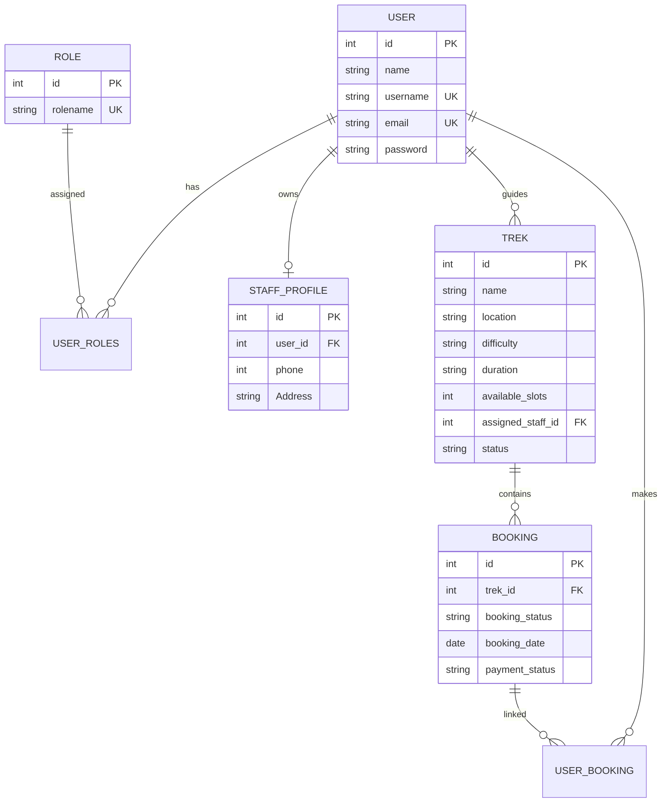

# 🏔️ Trekking Management Application

A feature-rich, role-based Web Application built with **Flask**, **SQLite**, and **Bootstrap 5** to streamline trek bookings, guide assignments, participant management, and administrative control.

---

## 📑 Table of Contents

- [Overview](#-overview)
- [Key Features](#-key-features)
  - [🛡️ Admin Module](#️-admin-module)
  - [🧢 Staff / Guide Module](#-staff--guide-module)
  - [🥾 Trekker Module](#-trekker-module)
  - [🔐 Security & Access Control](#-security--access-control)
- [System Architecture](#-system-architecture)
- [Database Schema & Data Models](#-database-schema--data-models)
- [Application Workflows](#-application-workflows)
  - [1. User Registration & Staff Approval Lifecycle](#1-user-registration--staff-approval-lifecycle)
  - [2. Trek Creation & Guide Assignment Workflow](#2-trek-creation--guide-assignment-workflow)
  - [3. Trek Discovery, Slot Booking & Cancellation Workflow](#3-trek-discovery-slot-booking--cancellation-workflow)
  - [4. User Blacklisting & Restoration Journey](#4-user-blacklisting--restoration-journey)
- [API Route & Endpoint Reference](#-api-route--endpoint-reference)
- [Project Directory Structure](#-project-directory-structure)
- [Setup & Installation Guide](#-setup--installation-guide)
- [Default System Credentials](#-default-system-credentials)
- [Future Enhancements](#-future-enhancements)

---

## 🌟 Overview

The **Trekking Management Application** provides an end-to-end digital solution for trekking agencies, adventure guides, and outdoor enthusiasts. It solves the challenges of manual trek scheduling, guide assignment, slot management, and booking tracking through a centralized platform.

The system enforces **Role-Based Access Control (RBAC)** across three primary user roles:
1. **Admin:** System supervisor managing overall operations, treks, staff approvals, bookings, and user access.
2. **Staff (Trek Guides):** Field guides managing assigned trek schedules, available slots, status updates, and participant rosters.
3. **Trekkers:** Customers exploring available treks, filtering by location or difficulty, booking slots, managing active trips, and viewing trekking history.

---

## ✨ Key Features

### 🛡️ Admin Module
- **System Overview Dashboard:** Real-time counters for total treks, active guides, pending approvals, total bookings, and blacklisted users.
- **Trek Management (CRUD):**
  - Create new treks with details (Name, Location, Difficulty, Duration, Total Slots, Status, Guide Assignment).
  - Edit trek attributes and reassign guides.
  - Delete treks from the catalog.
- **Staff Approval Workflow:** Review incoming staff registrations (`pending_staff`) and approve or reject them to grant guide privileges.
- **Guide Assignment:** Assign qualified staff members to specific open treks.
- **Booking Oversight:** View all bookings across all treks with status and user details.
- **User Blacklisting & Restoration:** Instantly block problematic users or restore access.
- **Global Search:** Search users and treks simultaneously across the system.

### 🧢 Staff / Guide Module
- **Assigned Treks Dashboard:** View treks where the logged-in staff member is designated as the primary guide.
- **Trek Status & Slot Management:** Update available slot count or change trek status (e.g., `Open`, `Closed`, `Completed`).
- **Participant Roster:** View all bookings and trekker details assigned to their treks.
- **Guide Profile Management:** Maintain contact details (Phone Number, Address) linked to the staff profile.

### 🥾 Trekker Module
- **Trek Catalog & Discovery:** Browse open treks with details on duration, difficulty, available slots, and assigned guide.
- **Advanced Search & Filtering:** Filter treks by name search, location keyword, or difficulty level (`Easy`, `Moderate`, `Hard`).
- **Slot Reservation & Booking:** Reserve slots instantly. Automatically decrements slot count and marks payment status as `Confirm`.
- **My Treks Dashboard:** Track active bookings separate from completed trekking history.
- **Booking Cancellation:** Cancel upcoming bookings prior to trek date, automatically restoring the slot count and updating payment status to `Refunded`.
- **Profile Updates:** Update personal profile details (Name, Email).

### 🔐 Security & Access Control
- **Password Hashing:** Passwords hashed with **Bcrypt** and salted before storage.
- **Session-Based RBAC:** Custom `@admin_required` decorator and session role checks ensuring unauthorized users cannot access restricted routes.
- **Blacklist Enforcement:** Suspended/blacklisted users are revoked access across sensitive actions.
- **Input Validation:** Backend validation for unique emails/usernames, slot counts, and phone number lengths.

---

## 🏗️ System Architecture

The application follows the classic **Model-View-Controller (MVC)** architectural pattern implemented with Flask.

```mermaid
graph TD
    Client[Web Browser / User] -->|HTTP Requests| FlaskApp[Flask Web Framework app.py]
    
    subgraph Security & Auth
        FlaskApp --> Session[Session Manager]
        FlaskApp --> RBAC[RBAC Middleware / Decorators]
        FlaskApp --> Bcrypt[Bcrypt Hashing]
    end
    
    subgraph Data & Persistence Layer
        FlaskApp --> SQLAlchemy[Flask-SQLAlchemy ORM]
        SQLAlchemy --> DB[(SQLite Database - app.db)]
    end
    
    subgraph Templates & UI
        FlaskApp --> Jinja[Jinja2 Template Engine]
        Jinja --> Bootstrap[Bootstrap 5 + Custom CSS]
        Bootstrap --> Client
```

---

## 🗄️ Database Schema & Data Models

The database consists of relational tables managed via SQLAlchemy with explicit foreign keys and relationship tables.



### Table Definitions

1. **`User` Table**
   - `id` (Integer, Primary Key)
   - `name` (String, Required)
   - `username` (String, Unique, Required)
   - `email` (String, Unique, Required)
   - `password` (String, Hashed, Required)
   - *Relationships:* `role` (via `user_roles`), `profile` (1-to-1 with `staff_profile`), `booking` (via `user_booking`), `assigned_treks` (1-to-Many with `trek`).

2. **`Role` Table**
   - `id` (Integer, Primary Key)
   - `rolename` (String, Unique, Required) — Values: `admin`, `staff`, `pending_staff`, `trekker`, `blacklisted`.

3. **`user_roles` Table (Junction)**
   - `user_id` (Foreign Key -> `User.id`)
   - `role_id` (Foreign Key -> `Role.id`)

4. **`trek` Table**
   - `id` (Integer, Primary Key)
   - `name` (String, Required)
   - `location` (String, Optional)
   - `difficulty` (String, e.g., Easy, Moderate, Hard)
   - `duration` (String)
   - `available_slots` (Integer)
   - `assigned_staff_id` (Foreign Key -> `User.id`, Optional)
   - `status` (String, e.g., Open, Closed, Completed)

5. **`Booking` Table**
   - `id` (Integer, Primary Key)
   - `trek_id` (Foreign Key -> `trek.id`)
   - `booking_status` (String, e.g., Confirm, Cancelled)
   - `booking_date` (Date)
   - `payment_status` (String, e.g., Confirm, Refunded)

6. **`user_booking` Table (Junction)**
   - `user_id` (Foreign Key -> `User.id`)
   - `booking_id` (Foreign Key -> `Booking.id`)

7. **`staff_profile` Table**
   - `id` (Integer, Primary Key)
   - `user_id` (Foreign Key -> `User.id`, Unique)
   - `phone` (BigInteger / Integer)
   - `Address` (String)

---

## 🔄 Application Workflows

### 1. User Registration & Staff Approval Lifecycle
1. User visits `/register` and submits details (Name, Username, Email, Password).
2. Selects role option: **Trekker** or **Trek Staff**.
   - **Trekker:** Assigned `trekker` role immediately; redirected to `/login`.
   - **Trek Staff:** Assigned `pending_staff` role; redirected to `/complete-staff-profile/<user_id>` to enter phone number and address.
3. Upon login, `pending_staff` users see a notification stating their registration is awaiting admin approval.
4. Admin views the **Pending Approvals** tab on `/admin-dashboard` and clicks **Approve**.
5. System updates role from `pending_staff` to `staff`, granting full access to `/staff-dashboard`.

### 2. Trek Creation & Guide Assignment Workflow
1. Admin clicks **Add Trek** on `/admin-dashboard` (`/add-trek`).
2. Fills out form: Trek Name, Location, Difficulty, Duration, Available Slots, Status (`Open`/`Closed`), and optionally selects an approved staff member from the dropdown.
3. System saves the trek to SQLite database.
4. If assigned, the trek appears immediately on the assigned guide's `/staff-dashboard`.
5. Staff members can update available slots or trek status via `/edit-staff-trek/<trek_id>`.

### 3. Trek Discovery, Slot Booking & Cancellation Workflow
1. Logged-in Trekker navigates to `/trekker-dashboard`.
2. Browses available treks or uses `/trekker-search` to filter by keyword, location, or difficulty level.
3. Clicks **Book Now** (`/book-trek/<trek_id>`).
4. System verifies:
   - Trek status is not `Closed` or `Completed`.
   - `available_slots > 0`.
5. Confirms booking:
   - Decrements `available_slots` by 1.
   - Creates `Booking` record (`booking_status='Confirm'`, `payment_status='Confirm'`).
   - Links booking to trekker via `user_booking`.
6. **Cancellation:** Trekker can cancel an active booking on `/trekker-dashboard`:
   - System updates `booking_status` to `Cancelled`, `payment_status` to `Refunded`.
   - Increments `available_slots` on the trek by 1.

### 4. User Blacklisting & Restoration Journey
1. Admin identifies a user needing restriction in `/admin-dashboard`.
2. Admin submits **Blacklist** (`/blacklist/<user_id>`).
3. System clears user's current roles and assigns `blacklisted`.
4. To restore: Admin clicks **Unblacklist** (`/unblacklist/<user_id>`).
5. System restores role: `staff` (if `staff_profile` exists) or `trekker`.

---

## 🔗 API Route & Endpoint Reference

| Endpoint | HTTP Method | Access Level | Description |
| :--- | :---: | :---: | :--- |
| `/` | `GET` | Public | Redirects to `/login`. |
| `/login` | `GET`, `POST` | Public | Authenticates user credentials and sets session variables. |
| `/logout` | `GET` | Authenticated | Clears user session and redirects to `/login`. |
| `/register` | `GET`, `POST` | Public | Registers a new Trekker or Staff user. |
| `/complete-staff-profile/<user_id>` | `GET`, `POST` | Public / Pending Staff | Collects phone number and address for staff registration. |
| `/admin-dashboard` | `GET` | Admin (`@admin_required`) | Admin control center displaying stats, treks, staff, approvals, and bookings. |
| `/add-trek` | `GET`, `POST` | Admin (`@admin_required`) | Renders creation form and handles new trek insertion. |
| `/edit-trek/<trek_id>` | `GET`, `POST` | Admin (`@admin_required`) | Renders edit form and updates existing trek attributes. |
| `/delete-trek/<trek_id>` | `POST` | Admin (`@admin_required`) | Deletes a trek record from the database. |
| `/delete-staff/<staff_id>` | `POST` | Admin (`@admin_required`) | Removes staff user and associated profile. |
| `/approve-staff/<user_id>` | `POST` | Admin (`@admin_required`) | Converts `pending_staff` role to active `staff`. |
| `/blacklist/<user_id>` | `POST` | Admin (`@admin_required`) | Revokes user roles and assigns `blacklisted` status. |
| `/unblacklist/<user_id>` | `POST` | Admin (`@admin_required`) | Restores user access back to `staff` or `trekker`. |
| `/assign-staff/<staff_id>` | `GET`, `POST` | Admin (`@admin_required`) | Assigns a staff member to a selected trek. |
| `/search` | `GET`, `POST` | Admin (`@admin_required`) | Executes global admin search across users and treks. |
| `/staff-dashboard` | `GET` | Staff | Guide portal listing assigned treks, bookings, and profile. |
| `/edit-staff-trek/<trek_id>` | `GET`, `POST` | Staff | Allows guide to update slot count and status of assigned trek. |
| `/update-profile` | `GET`, `POST` | Staff | Updates staff contact information (phone & address). |
| `/trekker-dashboard` | `GET` | Trekker | Trekker portal showing open treks, active bookings, and history. |
| `/trekker-search` | `GET`, `POST` | Trekker | Filters available treks by keyword, location, and difficulty. |
| `/update-trekker-profile` | `GET`, `POST` | Trekker | Updates trekker profile details (Name, Email). |
| `/book-trek/<trek_id>` | `GET`, `POST` | Trekker | Confirms slot reservation and creates booking record. |
| `/cancel-booking/<booking_id>` | `GET`, `POST` | Trekker | Cancels active booking, restores slot count, and updates refund status. |

---

## 📁 Project Directory Structure

```text
MAD1 PROJECT/
├── app.py                      # Primary Flask application server & route controllers
├── models.py                   # SQLAlchemy database models & relationship definitions
├── create-admin.py             # Database seed script for initializing default admin user
├── roles.py                    # Role helper constants
├── requirements.txt            # Python package dependencies
├── .gitignore                  # Git tracking exclusion rules
├── instance/
│   └── app.db                  # SQLite database file (generated)
├── migrations/                 # Flask-Migrate database migration scripts
├── static/
│   └── css/
│       └── style.css           # Custom dashboard & sidebar styles
└── templates/                  # Jinja2 HTML templates
    ├── base.html               # Master layout template (Bootstrap 5, Navbar, Footer)
    ├── login.html              # User authentication page
    ├── register.html           # User registration page
    ├── staff_details.html      # Staff profile completion form
    ├── admin_dashboard.html    # Admin management panel
    ├── add_trek.html           # Admin trek creation template
    ├── edit_trek.html          # Admin trek editing template
    ├── assign_staff.html       # Guide-to-trek assignment form
    ├── staff_dashboard.html    # Staff/Guide portal
    ├── edit_staff_trek.html    # Staff trek updating template
    ├── update_profile.html     # Staff profile edit page
    ├── trekker_dashboard.html  # Trekker portal & search results
    ├── book_trek.html          # Trek booking confirmation page
    └── update_trekker_profile.html # Trekker profile edit page
```

---

## 🛠️ Setup & Installation Guide

Follow these steps to run the application locally on Linux, macOS, or Windows.

### Prerequisites
- Python 3.8+ installed on your system.
- `pip` (Python package manager).

### Step-by-Step Installation

1. **Navigate to the Project Directory**
   ```bash
   cd "MAD1 PROJECT"
   ```

2. **Create and Activate a Virtual Environment**
   - **Linux / macOS:**
     ```bash
     python3 -m venv .venv
     source .venv/bin/activate
     ```
   - **Windows (Command Prompt):**
     ```cmd
     python -m venv .venv
     .venv\Scripts\activate
     ```

3. **Install Dependencies**
   ```bash
   pip install -r requirements.txt
   ```

4. **Initialize Database & Seed Admin Account**
   Run the administrative initialization script:
   ```bash
   python create-admin.py
   ```
   *Output:* `admin created successfully`

5. **Start the Flask Development Server**
   ```bash
   python app.py
   ```

6. **Access the Application**
   Open your browser and navigate to:
   ```text
   http://127.0.0.1:5000
   ```

---

## 🔑 Default System Credentials

| Role | Email | Password | Access Rights |
| :--- | :--- | :--- | :--- |
| **Admin** | `admin@admin.com` | `admin@123` | Full system oversight, CRUD treks, approve staff, user blacklisting. |

---

## 🚀 Future Enhancements

- 💳 **Online Payment Gateway:** Integration with Stripe / Razorpay for live booking payments.
- 📧 **Automated Email Notifications:** Booking confirmation and status change alerts via Flask-Mail.
- ⭐ **Reviews & Ratings:** Allow trekkers to leave feedback on completed treks and guides.
- 📊 **Analytics & PDF Export:** Export booking rosters and sales summaries in PDF/CSV formats.

---
