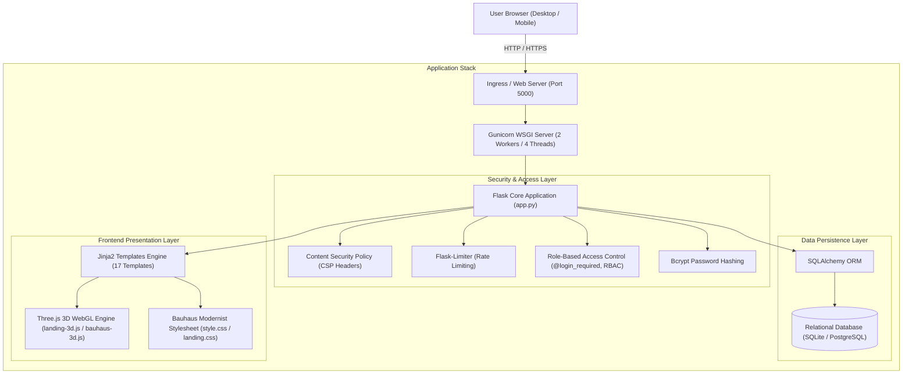

# 🏔️ TrekOps — Mountain Expedition & Trek Management Platform
### *Bauhaus Modernist UI • GPU-Accelerated Three.js 3D WebGL • Full-Stack Flask & SQLAlchemy*

[](https://www.python.org/)
[](https://flask.palletsprojects.com/)
[](https://threejs.org/)
[](https://www.sqlite.org/)
[](https://getbootstrap.com/)
[](https://www.docker.com/)
[](LICENSE)

---

**TrekOps** is a modern, full-stack mountain expedition and trek management platform built for outdoor explorers, certified mountain guides, and expedition administrators. 

Featuring a distinctive **Bauhaus Modernist (1919 Weimar)** aesthetic, **hardware-accelerated Three.js 3D graphics**, and role-based workflows, TrekOps provides an intuitive platform for discovering high-altitude trails, reserving verified expedition passes, and managing field dispatch operations.

---

## 📑 Table of Contents

- [Key Features & Capabilities](#-key-features--capabilities)
- [Visual Showcase & Design System](#-visual-showcase--design-system)
- [System Architecture](#-system-architecture)
- [Core User Roles & Workflows](#-core-user-roles--workflows)
- [Quick Start & Local Setup](#-quick-start--local-setup)
- [Seeded Demo Accounts](#-seeded-demo-accounts)
- [Production Deployment](#-production-deployment)
- [Developer & Contact](#-developer--contact)

---

## ✨ Key Features & Capabilities

* **🎨 Bauhaus Weimar 1919 Design System**: Strict 0px border-radius, high-contrast palette (Carmine Red `#D92525`, Cobalt Blue `#1A365D`, Chrome Yellow `#F6AE2D`, Stark Black `#121212`, Paper Canvas `#F7F5EE`), unblurred hard-offset shadows (`4px 4px 0px`), and seamless **Light / Dark Mode** switching (`Alt+T`).
* **🌌 Ultra-Smooth 3D Scroll Landing Engine**: Hardware-accelerated Three.js WebGL background with dynamic altitude flight, floating constructivist polyhedra, contour rings, and particle starfields coupled with scroll inertia at 60–120 FPS.
* **🎴 Interactive 3D Card Feature Carousel**: Autoplaying 3D card deck highlighting Trekker, Guide, Admin, and Digital Permit modules with mouse hover pause and keyboard controls.
* **⚡ Kinetic Micro-Interactions**: Innovative directional magnetic button animations (`.bh-btn-kinetic`) with high-contrast active states.
* **🎟️ Print-Ready Digital Expedition Pass**: Official booking vouchers with verification codes, emergency SAR dossiers, gear checklists, and print-optimized (`@media print` DIN A4) layouts.
* **🛡️ Security & Authentication**: Bcrypt password hashing (12 salt rounds), role-based route decorators (`@admin_required`, `@staff_required`, `@trekker_required`), Content Security Policy (CSP), and user sanctioning.
* **📦 Production-Ready Architecture**: Gunicorn WSGI multi-threading, automated database schema and role bootstrapping (`init_db_and_seed`), Docker containerization, and `/healthz` readiness probes.

---

## 🎨 Visual Showcase & Design System

The visual language blends 20th-century German Constructivism with modern web technology:

| Interface View | Description | Key Capabilities |
| :--- | :--- | :--- |
| **Landing Experience** | Minimalist Bauhaus Hero & 3D Flight | 3D WebGL scroll flight, interactive feature carousel, developer dossier, live metrics. |
| **Trekker Dashboard** | Explorer Expedition Discovery | Trail catalog discovery, difficulty filters, live slot availability, booking history. |
| **Field Guide Portal** | Guide Command & Dispatch | Assigned trail logs, live status progression (Upcoming, Ongoing, Completed), participant manifests. |
| **Admin Operations** | Centralized Platform Governance | Expedition catalog CRUD, guide vetting applications, user directory, sanctioning. |
| **Expedition Pass** | Digital & Printable Permit | Dark/Light mode adaptive voucher, DIN A4 print styling, basecamp verification stamp. |

---

## 🏗️ System Architecture


```mermaid
graph TD
    Client["User Browser (Desktop / Mobile)"] -->|HTTP / HTTPS| Ingress["Ingress / Web Server (Port 5000)"]
    
    subgraph Application Stack
        Ingress --> Gunicorn["Gunicorn WSGI Server (2 Workers / 4 Threads)"]
        Gunicorn --> FlaskApp["Flask Core Application (app.py)"]
        
        subgraph Security & Access Layer
            FlaskApp --> CSP["Content Security Policy (CSP Headers)"]
            FlaskApp --> Limiter["Flask-Limiter (Rate Limiting)"]
            FlaskApp --> Auth["Role-Based Access Control (@login_required, RBAC)"]
            FlaskApp --> Bcrypt["Bcrypt Password Hashing"]
        end
        
        subgraph Data Persistence Layer
            FlaskApp --> SQLAlchemy["SQLAlchemy ORM"]
            SQLAlchemy --> Database[("Relational Database (SQLite / PostgreSQL)")]
        end
        
        subgraph Frontend Presentation Layer
            FlaskApp --> Jinja["Jinja2 Templates Engine (17 Templates)"]
            Jinja --> ThreeJS["Three.js 3D WebGL Engine (landing-3d.js / bauhaus-3d.js)"]
            Jinja --> BauhausCSS["Bauhaus Modernist Stylesheet (style.css / landing.css)"]
        end
    end
```

---

## 👥 Core User Roles & Workflows

### 🥾 1. Trekker (Explorer)
- **Trail Discovery**: Browse mountain trails with elevation details, itineraries, and difficulty ratings (*Easy*, *Moderate*, *Hard*).
- **Slot Reservation**: Book available slots with participant information and emergency contacts.
- **My Expeditions**: View upcoming and completed bookings with live status tracking.
- **Digital Permit**: View and print official DIN A4 booking vouchers for checkpoint validation.

### 🧢 2. Certified Field Guide (Staff)
- **Assigned Expeditions**: Monitor all expeditions assigned by the administration.
- **Status Progression**: Update live trail operations (`Open` ➔ `Started` ➔ `Ongoing` ➔ `Completed`).
- **Participant Manifest**: Access participant rosters with emergency contact numbers and medical data.
- **Guide Profile**: Maintain verified contact details and basecamp station info.

### 🛡️ 3. Administrator
- **Expedition Catalog Management**: Create, edit, and schedule trekking routes with pricing and slot limits.
- **Guide Vetting**: Review incoming guide registration applications and grant certified credentials.
- **User Governance**: Search user directories and instantly sanction/unblock accounts.
- **Analytics Overview**: Real-time overview of active trails, total bookings, and registered participants.

---

## 💻 Quick Start & Local Setup

### Prerequisites
* **Python 3.10+** (Python 3.11 or 3.12 recommended)
* **Git**

### Installation

```bash
# 1. Clone the repository
git clone https://github.com/24f2008062/Trekking-Management-Application.git
cd Trekking-Management-Application

# 2. Create and activate a Python virtual environment
python3 -m venv venv
source venv/bin/activate  # On Windows: venv\Scripts\activate

# 3. Install dependencies
pip install --upgrade pip
pip install -r requirements.txt

# 4. Start the application
python app.py
```

Open your browser and navigate to **`http://127.0.0.1:5000/`**.

> **Note**: Database tables, default roles, demo personas, and mock treks are automatically provisioned on startup by `init_db_and_seed(app)`. No manual database migrations required!

---

## 🔑 Seeded Demo Accounts

The application includes pre-configured demo accounts for testing and grading:

| Role | Email Address | Password | Permissions & Scope |
| :--- | :--- | :--- | :--- |
| **Administrator** | `admin@admin.com` | `admin@123` | Full admin dashboard, trek CRUD, guide vetting, user sanctioning. |
| **Field Guide** | `guide@trek.com` | `guide@123` | Assigned expedition dispatch, participant manifest, status updates. |
| **Trekker** | `testuser0123@gmail.com` | `trekker@123` | Trail discovery, slot reservations, booking passes. |

*You can also use the floating **00 // DEMO PERSONAS** pill on the bottom-right of the login page to 1-click auto-fill credentials.*

---

## 🐳 Production Deployment

### Docker Deployment

```bash
# Build the production Docker image
docker build -t trekops-app .

# Run the container
docker run -d -p 5000:5000 \
  -e FLASK_SECRET_KEY="your-production-secret-key" \
  -e PORT=5000 \
  --name trekops-app \
  trekops-app

# Check health status
curl http://localhost:5000/healthz
```

### Cloud PaaS Deployment (Render / Railway / Heroku)

1. Connect this repository to your **Render** or **Railway** dashboard.
2. The platform automatically detects the [`Procfile`](file:///mnt/8A7C87E87C87CCFF/CODESPACE/MAD1%20PROJECT/Procfile) and starts the Gunicorn server:
   ```procfile
   web: gunicorn --bind 0.0.0.0:$PORT --workers 2 --threads 4 --timeout 120 wsgi:app
   ```
3. Set optional environment variables:
   - `FLASK_SECRET_KEY`: Custom secret session key.
   - `DATABASE_URL`: PostgreSQL connection string (if using external PostgreSQL).

---

## 👨‍💻 Developer & Creator

**Sanidhya Srivastava**  
*Full-Stack Systems Developer & Creator*

- 🌐 **Portfolio**: [sanidhy-dev.vercel.app](https://sanidhy-dev.vercel.app/)
- ✉️ **Email**: [sanidhyasrivastava01@gmail.com](mailto:sanidhyasrivastava01@gmail.com)
- 🐙 **GitHub**: [@24f2008062](https://github.com/24f2008062)

---

## 📜 License

This project is open-source and licensed under the [MIT License](LICENSE).
