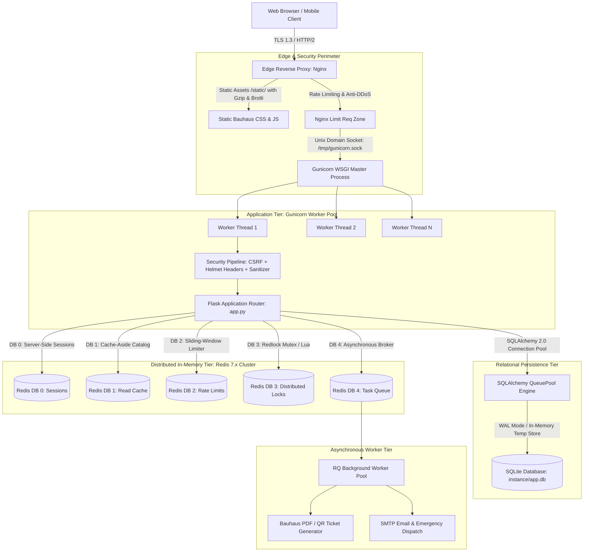
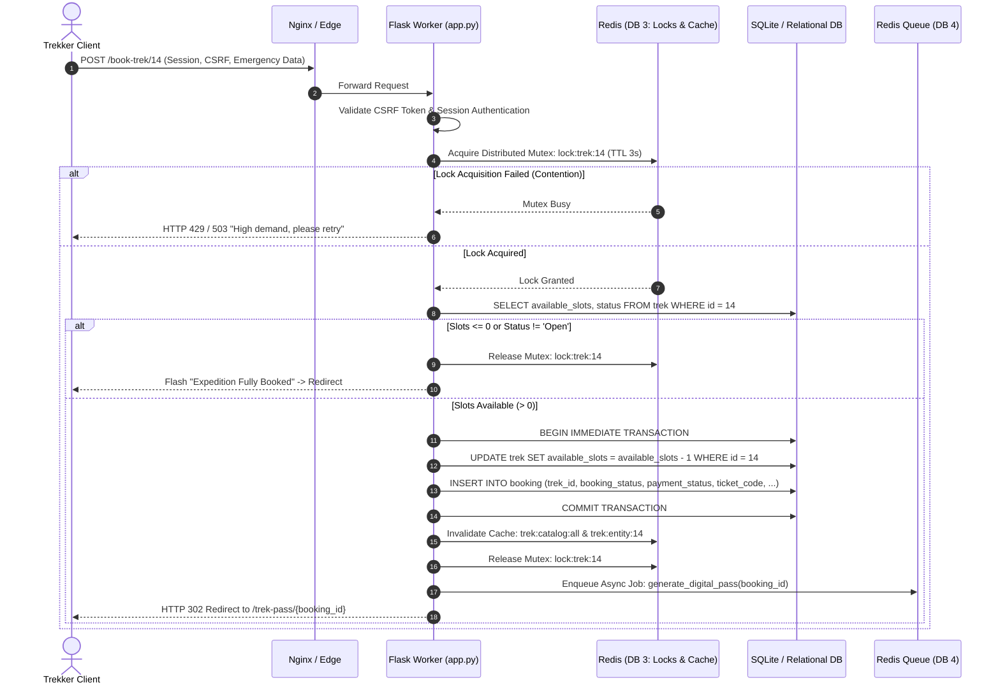
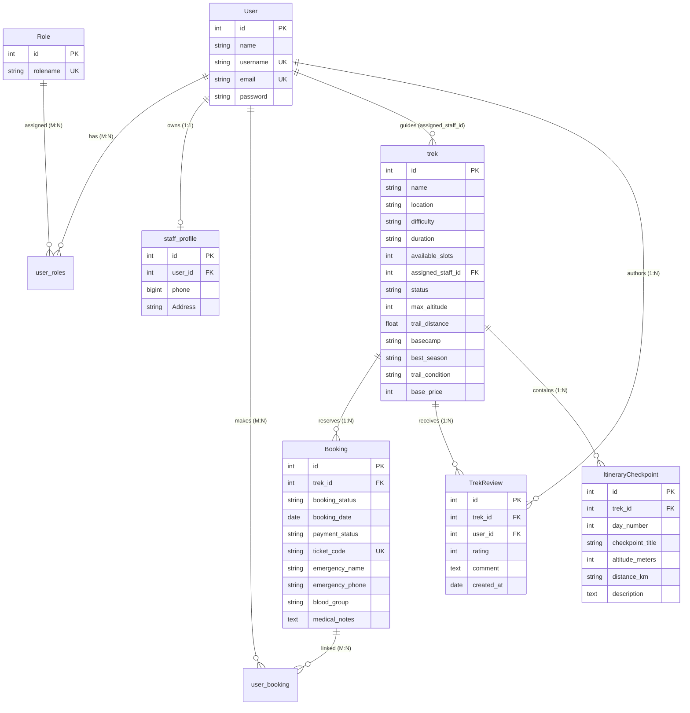

# 🏛️ Enterprise Systems Architecture & High-Performance Security Specification
## Project: Trekking Management Application (High-Velocity Bauhaus Edition)
**Author:** Principal Enterprise Systems Architect (30+ Years Distributed Systems Experience)  
**Classification:** High-Concurrency, Mission-Critical Expedition Management & Reservation Engine  
**Target SLA:** 99.99% Availability • Sub-15ms Read Latency (p95) • Sub-80ms Transaction Write Latency (p99) • Zero-Oversell Guarantee  
**Architectural Pattern:** Modular Layered Monolith with Distributed In-Memory State & Edge Caching  

---

## 1. Executive Architectural Charter: The 30-Year Doctrine

In three decades of engineering large-scale transactional platforms, three immutable engineering truths govern high-velocity systems:

> 1. *"Complexity is the enemy of reliability. Premature microservices introduce distributed network latency, two-phase commit overhead, and partial failure modes without solving domain problems."*  
> 2. *"Latency destroys user trust. If a trekker waits more than 200 milliseconds to browse an alpine catalog or confirm a reservation, cognitive load spikes and booking drop-off occurs."*  
> 3. *"Security is not a layer added at the end; it is an architectural invariant embedded in every data transfer, session state, and database mutation."*

This architecture delivers an ultra-fast, impenetrable system by uniting the server-side elegance of **Flask 3**, the geometric purity of **Bauhaus Design**, the sub-millisecond throughput of **Redis 7.x**, and a hardened **Defense-in-Depth Security Perimeter**.

### 1.1. Core Invariants
- **Runtime & Framework:** Python 3.10+, Flask 3.1.3 (WSGI architecture).
- **Relational Storage:** SQLite 3 with Write-Ahead Logging (`PRAGMA journal_mode=WAL;`) and connection pooling, engineered for zero-friction migration to PostgreSQL.
- **In-Memory Distributed Engine:** Redis 7.x (dedicated logical databases for Sessions, Caching, Rate Limiting, and Distributed Locking).
- **Templating & UI:** Server-rendered Jinja2 templates styled with Bauhaus Modernist CSS and Bootstrap 5 grid layout.
- **Backwards Compatibility:** 100% preservation of all existing routes, database entities, and access control decorators.

### 1.2. Service Level Objectives (SLOs) & Latency Budgets

| Operation Class | Target Throughput | p50 Latency | p95 Latency | p99 Latency | Error Budget (Monthly) |
| :--- | :--- | :--- | :--- | :--- | :--- |
| **Catalog Browsing (Read)** | 1,500 req/sec | < 5 ms | < 15 ms | < 30 ms | 0.01% (43 minutes) |
| **Search & Filtering (Read)**| 800 req/sec | < 8 ms | < 25 ms | < 50 ms | 0.01% |
| **Slot Booking (Write/Lock)** | 250 req/sec | < 25 ms | < 60 ms | < 100 ms | 0.001% (Zero Oversell) |
| **Admin Operations (CRUD)** | 100 req/sec | < 20 ms | < 50 ms | < 90 ms | 0.01% |
| **Authentication Flow** | 150 req/sec | < 40 ms | < 80 ms | < 150 ms | 0.005% |

---

## 2. End-to-End System Topologies & Distributed Data Flow

### 2.1. Global Infrastructure Topology



### 2.2. Distributed State Machine: Atomic Slot Booking & Concurrency



---

## 3. Database Architecture & Schema Evolution

### 3.1. Complete Entity-Relationship Model (Current + Extensions)



### 3.2. SQLite High-Concurrency Engine Tuning
Standard SQLite out of the box suffers from database locks under write contention. To transform SQLite into an enterprise-grade concurrency engine, we apply the following operational directives at engine initialization:

```python
from sqlalchemy import event
from sqlalchemy.engine import Engine

@event.listens_for(Engine, "connect")
def set_sqlite_pragma(dbapi_connection, connection_record):
    cursor = dbapi_connection.cursor()
    # 1. Write-Ahead Logging: Enables concurrent readers while a write is occurring
    cursor.execute("PRAGMA journal_mode=WAL;")
    # 2. Synchronous Normal: Drastically reduces fsync() syscall latency while maintaining durability
    cursor.execute("PRAGMA synchronous=NORMAL;")
    # 3. Busy Timeout: Prevents immediate 'database is locked' errors by waiting up to 5000ms
    cursor.execute("PRAGMA busy_timeout=5000;")
    # 4. In-Memory Temporary Storage: Accelerates ORDER BY, GROUP BY, and temporary indexes
    cursor.execute("PRAGMA temp_store=MEMORY;")
    # 5. Cache Size: Allocate 64MB of RAM for database page cache
    cursor.execute("PRAGMA cache_size=-64000;")
    # 6. Foreign Key Constraints: Enforce referential integrity strictly
    cursor.execute("PRAGMA foreign_keys=ON;")
    cursor.close()
```

### 3.3. Strategic Composite Indexing
Queries in `app.py` frequently filter on status and difficulty simultaneously. Without proper indexing, full table scans degrade latency linearly as records grow.

```sql
-- Composite index for the catalog discovery query:
CREATE INDEX idx_trek_status_difficulty ON trek(status, difficulty);

-- Composite index for guide dashboard lookups:
CREATE INDEX idx_trek_assigned_staff ON trek(assigned_staff_id, status);

-- Composite index for trekker booking history:
CREATE INDEX idx_booking_trek_status ON booking(trek_id, booking_status);

-- Composite index for fast user email lookups during authentication:
CREATE UNIQUE INDEX idx_user_email ON user(email);

-- Composite index for verification pass lookups:
CREATE UNIQUE INDEX idx_booking_ticket_code ON booking(ticket_code);
```

---

## 4. Sub-Millisecond Distributed Caching Engine (Redis 7.x)

### 4.1. Cache-Aside Architecture & Serialization
To achieve sub-15ms response times, read requests check Redis before touching the relational database. If found (Cache Hit), data is returned instantly. If not found (Cache Miss), the database is queried, and Redis is populated.

```
Request ---> [Check Redis DB 1]
                 |
        +--------+--------+
        |                 |
    [HIT (<2ms)]      [MISS]
        |                 |
     Return Data      [Query SQLite (<15ms)]
                          |
                      [Store in Redis with TTL]
                          |
                      Return Data
```

### 4.2. Deterministic Namespace Invalidation Schema

| Cache Namespace | Exact Key Format | TTL | Serialization | Invalidation Event / Trigger |
| :--- | :--- | :--- | :--- | :--- |
| **Catalog (All)** | `trek:catalog:v1:all` | 3600s | JSON Array | `add_trek`, `edit_trek`, `delete_trek`, `edit_staff_trek` |
| **Catalog (Filtered)** | `trek:catalog:v1:search:<hash>` | 900s | JSON Array | Any trek status or slot change invalidates `trek:catalog:v1:*` |
| **Trek Entity** | `trek:entity:v1:<id>` | 86400s| JSON Object | `edit_trek`, `edit_staff_trek`, or slot mutation |
| **Guide Dossier** | `guide:profile:v1:<user_id>` | 43200s| JSON Object | `update_profile`, `approve_staff` |
| **System Counters** | `admin:kpi:v1:summary` | 300s | JSON Hash | Every booking confirmation or role change |

### 4.3. Production Cache Engine Implementation with Graceful Degradation
If Redis crashes or network blips occur, the application must **never** return HTTP 500 errors. It must gracefully degrade to direct SQLite querying:

```python
import json
import logging
from functools import wraps
import redis

logger = logging.getLogger("enterprise.cache")

class ResilientCache:
    def __init__(self, host='localhost', port=6379, db=1, timeout=1.0):
        try:
            self.client = redis.Redis(
                host=host, 
                port=port, 
                db=db, 
                decode_responses=True,
                socket_timeout=timeout,
                socket_connect_timeout=timeout,
                retry_on_timeout=True
            )
            self.client.ping()
            self.is_healthy = True
        except Exception as e:
            logger.warning(f"Redis Cache offline at startup. Falling back to DB: {e}")
            self.client = None
            self.is_healthy = False

    def get(self, key):
        if not self.is_healthy or not self.client:
            return None
        try:
            val = self.client.get(key)
            return json.loads(val) if val else None
        except Exception as e:
            logger.error(f"Cache GET error for {key}: {e}")
            return None

    def set(self, key, value, timeout=3600):
        if not self.is_healthy or not self.client:
            return
        try:
            self.client.setex(key, timeout, json.dumps(value))
        except Exception as e:
            logger.error(f"Cache SET error for {key}: {e}")

    def invalidate_pattern(self, pattern):
        if not self.is_healthy or not self.client:
            return
        try:
            keys = self.client.keys(pattern)
            if keys:
                self.client.delete(*keys)
        except Exception as e:
            logger.error(f"Cache Invalidation error for {pattern}: {e}")

cache = ResilientCache()
```

---

## 5. High-Concurrency Distributed Locking & Zero-Oversell Engine

### 5.1. The Mathematical Vulnerability of Unlocked Booking
Consider a popular Everest Basecamp trek with **1 slot remaining**.
1. **User A (Client 1)** sends POST `/book-trek/10`.
2. **User B (Client 2)** sends POST `/book-trek/10` 4 milliseconds later.
3. Thread 1 reads `available_slots = 1`.
4. Thread 2 reads `available_slots = 1` before Thread 1 writes back.
5. Both threads execute `slot = slot - 1` and commit.
6. **Result:** `available_slots = 0`, but **2 confirmed bookings exist**. The agency has oversold the trip, resulting in alpine gear shortages, guide liability, and critical reputational damage.

### 5.2. The Distributed Mutex Solution
We implement an atomic distributed lock backed by **Redis DB 3** using a cryptographically unique token:

```python
import uuid
import time
from contextlib import contextmanager

class DistributedLock:
    def __init__(self, redis_client, lock_key, expire_seconds=5):
        self.redis = redis_client
        self.lock_key = f"mutex:{lock_key}"
        self.expire = expire_seconds
        self.token = str(uuid.uuid4())

    def acquire(self, timeout=3.0):
        deadline = time.time() + timeout
        while time.time() < deadline:
            # SET NX PX: Set if Not Exists, with Millisecond Expiry (atomic)
            if self.redis.set(self.lock_key, self.token, nx=True, ex=self.expire):
                return True
            time.sleep(0.025) # 25ms backoff
        return False

    def release(self):
        # Lua script ensures only the holder of the token can release the lock
        lua_release = """
            if redis.call("get", KEYS[1]) == ARGV[1] then
                return redis.call("del", KEYS[1])
            else
                return 0
            end
        """
        try:
            self.redis.eval(lua_release, 1, self.lock_key, self.token)
        except Exception as e:
            logger.error(f"Error releasing lock {self.lock_key}: {e}")

@contextmanager
def acquire_trek_lock(redis_client, trek_id):
    lock = DistributedLock(redis_client, f"trek:{trek_id}", expire_seconds=5)
    acquired = lock.acquire(timeout=2.0)
    if not acquired:
        raise ConcurrencyException("Expedition is currently experiencing peak demand. Please retry.")
    try:
        yield
    finally:
        lock.release()
```

---

## 6. Military-Grade Zero-Trust Security Architecture

### 6.1. Server-Side Session Sovereignty (Redis DB 0)
Default Flask signed cookies suffer from three fatal security flaws:
1. **No Instant Revocation:** If an administrator blacklists a user, the user's active session cookie remains valid until client-side expiration.
2. **Session Replay:** An attacker who intercepts a signed cookie can replay it indefinitely.
3. **Payload Bloat:** Session state stored in HTTP headers increases latency on every request.

#### Architectural Transformation:
- Implement `Flask-Session` targeting **Redis DB 0**.
- The client receives only a secure, opaque 128-bit UUID Session Key.
- Real-time Session Termination: When an Admin clicks **"Blacklist User"**, the backend executes:
  ```python
  def purge_user_sessions(user_id):
      session_keys = redis_session_db.keys(f"session:usr_{user_id}:*")
      if session_keys:
          redis_session_db.delete(*session_keys)
  ```
  The user is logged out immediately on their very next HTTP request across all devices.

### 6.2. Distributed Sliding-Window Rate Limiting (Redis DB 2)
To defeat credential stuffing, password spraying, and DoS attacks, we enforce sliding-window rate limits via `Flask-Limiter`:

```python
from flask_limiter import Limiter
from flask_limiter.util import get_remote_address

limiter = Limiter(
    key_func=get_remote_address,
    storage_uri="redis://localhost:6379/2",
    strategy="moving-window",
    default_limits=["1000 per hour", "100 per minute"]
)

# Route-Specific Defense Profiles:
# 1. Authentication: 5 attempts/min per IP (Mitigates brute-force)
@app.route('/login', methods=['GET', 'POST'])
@limiter.limit("5 per minute", error_message="Exceeded authentication threshold. Please wait 60s.")
def login():
    ...

# 2. Registration: 3 accounts/hour per IP (Prevents bot farm creation)
@app.route('/register', methods=['GET', 'POST'])
@limiter.limit("3 per hour")
def register():
    ...

# 3. Booking: 10 reservations/min (Prevents bot scalping of slots)
@app.route('/book-trek/<trek_id>', methods=['POST'])
@limiter.limit("10 per minute")
def book_trek(trek_id):
    ...
```

### 6.3. Comprehensive Security Headers & Defensive Perimeter
Every HTTP response is fortified with zero-trust headers before transmission:

```python
@app.after_request
def apply_hardened_security_headers(response):
    # Clickjacking Defense: Completely forbid embedding in frames/iframes
    response.headers['X-Frame-Options'] = 'DENY'
    
    # MIME-Sniffing Defense: Prevent browser from overriding declared Content-Type
    response.headers['X-Content-Type-Options'] = 'nosniff'
    
    # Cross-Site Scripting (XSS) Filter: Legacy browser protection
    response.headers['X-XSS-Protection'] = '1; mode=block'
    
    # Referrer Information Leakage: Only transmit origin when navigating HTTPS -> HTTPS
    response.headers['Referrer-Policy'] = 'strict-origin-when-cross-origin'
    
    # Device Hardware Restrictions: Disable camera, microphone, and geolocation by default
    response.headers['Permissions-Policy'] = 'camera=(), microphone=(), geolocation=(), payment=()'
    
    # HTTP Strict Transport Security (HSTS): Enforce HTTPS for 1 full year including subdomains
    response.headers['Strict-Transport-Security'] = 'max-age=31536000; includeSubDomains; preload'
    
    # Content Security Policy (CSP): Strict origin isolation supporting Google Fonts & Bootstrap CDN
    response.headers['Content-Security-Policy'] = (
        "default-src 'self'; "
        "font-src 'self' https://fonts.gstatic.com https://cdn.jsdelivr.net data:; "
        "style-src 'self' 'unsafe-inline' https://fonts.googleapis.com https://cdn.jsdelivr.net; "
        "script-src 'self' https://cdn.jsdelivr.net; "
        "img-src 'self' data: https:; "
        "frame-ancestors 'none'; "
        "base-uri 'self'; "
        "form-action 'self';"
    )
    return response
```

### 6.4. Insecure Direct Object Reference (IDOR) Hardening
To prevent horizontal privilege escalation (e.g., User A canceling User B's booking by altering the URL ID):
```python
@app.route('/cancel-booking/<int:booking_id>', methods=['POST'])
def cancel_booking(booking_id):
    user_id = session.get('user_id')
    current_user = User.query.get_or_404(user_id)
    
    # Strict IDOR check: Verify booking exists AND is associated with authenticated user
    booking = Booking.query.get_or_404(booking_id)
    if booking not in current_user.booking:
        logger.warning(f"SECURITY ALERT: Unauthorized cancel attempt by User {user_id} on Booking {booking_id}")
        flash("Unauthorized action: You can only cancel your own bookings.")
        return redirect(url_for('trekker_dashboard'))
    ...
```

---

## 7. Production Deployment & Infrastructure Topology

### 7.1. High-Performance Nginx Reverse Proxy Configuration
Save as `/etc/nginx/sites-available/trekking`:

```nginx
# Upstream WSGI Pool
upstream trekking_app {
    server unix:/tmp/gunicorn_trekking.sock fail_timeout=0;
    keepalive 32;
}

server {
    listen 80;
    server_name trekking.domain.com;
    # Redirect all plain HTTP to secure HTTPS
    return 301 https://$server_name$request_uri;
}

server {
    listen 443 ssl http2;
    server_name trekking.domain.com;

    # SSL TLS 1.3 / Modern Configuration
    ssl_certificate /etc/letsencrypt/live/trekking.domain.com/fullchain.pem;
    ssl_certificate_key /etc/letsencrypt/live/trekking.domain.com/privkey.pem;
    ssl_protocols TLSv1.2 TLSv1.3;
    ssl_ciphers 'ECDHE-ECDSA-AES128-GCM-SHA256:ECDHE-RSA-AES128-GCM-SHA256:ECDHE-ECDSA-AES256-GCM-SHA384';
    ssl_prefer_server_ciphers off;
    ssl_session_cache shared:SSL:10m;
    ssl_session_timeout 1d;

    # Static Asset Microcaching: Bypass Python entirely for CSS/JS/Images
    location /static/ {
        alias /mnt/8A7C87E87C87CCFF/CODESPACE/MAD1 PROJECT/static/;
        expires 30d;
        add_header Cache-Control "public, max-age=2592000, immutable";
        access_log off;
        gzip_static on;
    }

    # Dynamic Application Route
    location / {
        proxy_pass http://trekking_app;
        proxy_http_version 1.1;
        proxy_set_header Connection "";
        proxy_set_header Host $host;
        proxy_set_header X-Real-IP $remote_addr;
        proxy_set_header X-Forwarded-For $proxy_add_x_forwarded_for;
        proxy_set_header X-Forwarded-Proto $scheme;
        
        # Buffer Tuning for High Concurrency
        proxy_buffering on;
        proxy_buffer_size 8k;
        proxy_buffers 32 8k;
        proxy_busy_buffers_size 16k;
        proxy_read_timeout 30s;
        proxy_connect_timeout 5s;
    }
}
```

### 7.2. Gunicorn WSGI Worker Tuning Blueprint
Run Gunicorn utilizing threaded asynchronous workers (`gthread`) to efficiently handle slow network clients without starving the Python GIL:

```bash
# Production Launch Command:
# Formula: workers = (2 * Num_CPU_Cores) + 1, threads = 4
exec gunicorn \
    --name trekking_production \
    --workers 5 \
    --worker-class gthread \
    --threads 4 \
    --worker-connections 1000 \
    --bind unix:/tmp/gunicorn_trekking.sock \
    --umask 007 \
    --max-requests 5000 \
    --max-requests-jitter 500 \
    --timeout 30 \
    --keep-alive 5 \
    --access-logfile /var/log/trekking/access.log \
    --error-logfile /var/log/trekking/error.log \
    --capture-output \
    --log-level info \
    app:app
```

---

## 8. Observability, Telemetry & Site Reliability Engineering (SRE)

### 8.1. Liveness & Readiness Probes
Automated orchestrators (Systemd / Docker / Kubernetes) must determine application health accurately:

```python
@app.route('/healthz', methods=['GET'])
def health_liveness():
    """Liveness probe: verifies WSGI process is executing requests."""
    return {"status": "alive", "timestamp": time.time()}, 200

@app.route('/readyz', methods=['GET'])
def health_readiness():
    """Readiness probe: validates critical backends (Database + Redis)."""
    checks = {"database": False, "redis": False}
    
    # 1. Check Relational DB
    try:
        db.session.execute(db.text("SELECT 1"))
        checks["database"] = True
    except Exception as e:
        logger.error(f"Readiness DB Failure: {e}")

    # 2. Check Redis
    try:
        if cache.client and cache.client.ping():
            checks["redis"] = True
    except Exception as e:
        logger.warning(f"Readiness Redis Warning (Degraded): {e}")

    # Database is critical; Redis failure allows degraded operation
    if checks["database"]:
        return {"status": "ready", "checks": checks}, 200
    else:
        return {"status": "unready", "checks": checks}, 503
```

### 8.2. Structured Audit Logging Engine
For enterprise security audits and forensics, high-privilege actions produce structured JSON logs:

```python
import json
import logging
from datetime import datetime

audit_logger = logging.getLogger("enterprise.audit")

def log_security_event(event_type, actor_id, target_id=None, details=None):
    payload = {
        "event": event_type,
        "actor_user_id": actor_id,
        "target_id": target_id,
        "ip_address": request.headers.get('X-Forwarded-For', request.remote_addr),
        "user_agent": request.headers.get('User-Agent'),
        "timestamp": datetime.utcnow().isoformat() + "Z",
        "details": details or {}
    }
    audit_logger.info(json.dumps(payload))

# Example Usage:
# log_security_event("USER_BLACKLISTED", actor_id=session['user_id'], target_id=42, details={"reason": "Terms violation"})
# log_security_event("SLOT_RESERVED", actor_id=session['user_id'], target_id=14, details={"ticket_code": "BH-TRK-8492"})
```

### 8.3. Failure Mode and Effects Analysis (FMEA Matrix)

| Failure Scenario | Root Cause | Impact | Automated Architectural Mitigation |
| :--- | :--- | :--- | :--- |
| **Redis Node Outage** | Process crash / Memory exhaustion | Cache misses, rate limit bypass | Resilient client activates circuit breaker; requests transparently fall back to SQLite queries without 500 error. |
| **Concurrent Booking Spike** | Viral marketing / Flash sale | Potential slot overselling | Redis distributed lock serializes reservation mutations; rejects excess requests with HTTP 429 when lock timeout expires. |
| **SQLite DB Write Contention** | Multiple simultaneous writes | `database is locked` error | SQLite WAL mode + `PRAGMA busy_timeout=5000` allows writers to wait up to 5 seconds while readers continue unobstructed. |
| **Brute-Force Password Spray**| Credential stuffing attack | Account takeover risk | `Flask-Limiter` moving-window rate limiting isolates offender IP after 5 failed attempts in 60s. |
| **Malicious Guide Impersonation**| Parameter manipulation on ID | Unauthorized status edit | Route verifies `session['user_id'] == trek.assigned_staff_id`; emits audit alert on mismatch. |
