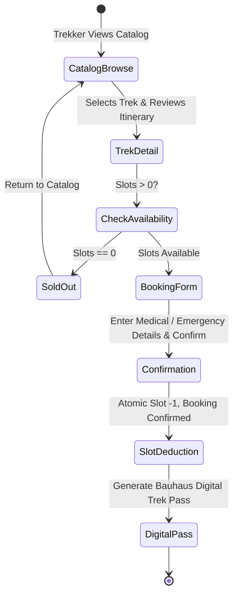
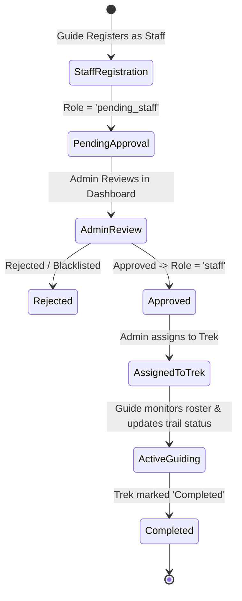

# 📋 Product Requirements Document (PRD)
## Project: Trekking Management Application (Bauhaus Edition)
**Status:** Approved for Implementation  
**Target Platform:** Web (Desktop & Mobile Responsive)  
**Tech Stack:** Python 3.10+, Flask 3.1.3, Jinja2, Flask-SQLAlchemy 3.1.1, SQLite 3, Bootstrap 5.3.8 + Bauhaus CSS Engine  

---

## 1. Executive Summary

The **Trekking Management Application** is a specialized, role-based platform engineered for outdoor adventure agencies, expedition leaders, and mountain trekkers. The platform coordinates the entire lifecycle of outdoor expeditions: from cataloging scenic trekking trails and scheduling expeditions, to assigning certified alpine guides, managing trekker reservations, and processing real-time slot availability.

This document formalizes the product requirements for transitioning the existing application to an iconic **Bauhaus visual language** while expanding product capabilities without modifying the core technical stack.

---

## 2. Product Vision & Principles

> *"Let us create a new guild of craftsmen, without the class distinctions which raise an arrogant barrier between craftsman and artist."*  
> — Walter Gropius, Bauhaus Manifesto (1919)

1. **Form Follows Function:** Every layout partition, button, and typographic hierarchy exists to facilitate swift booking, navigation, and expedition coordination.
2. **Maximum Clarity Under Stress:** Trekkers and guides often consult software in high-glare or outdoor environments. High-contrast color blocks and geometric legibility prioritize rapid scanning.
3. **Preservation of Core Simplicity:** Maintain the lightweight, fast-loading, server-rendered Flask + SQLite architecture without bloated client-side JavaScript frameworks.

---

## 3. User Personas

### 3.1. The Expedition Supervisor (Admin)
- **Profile:** Agency operator or head of trekking operations.
- **Responsibilities:**
  - Curating trek catalog (routes, altitudes, slots, difficulty levels).
  - Vetting and approving guide registrations.
  - Assigning guides to upcoming treks.
  - Monitoring booking volume and agency revenue.
  - Managing user sanctions and safety blacklists.
- **Pain Points:** Needs an at-a-glance high-contrast command center to detect unassigned treks or guide shortages instantly.

### 3.2. The Alpine Guide (Staff)
- **Profile:** Certified wilderness guides and mountain leads.
- **Responsibilities:**
  - Checking assigned expeditions and briefing schedules.
  - Reviewing trekker manifests (who is on the mountain, emergency contacts, medical declarations).
  - Updating real-time trek statuses (`Open`, `In Progress`, `Completed`, `Closed`) and remaining slots.
  - Maintaining guide contact profiles for emergency dispatch.
- **Pain Points:** Cluttered user interfaces with tiny fonts fail outdoors on mobile devices. Needs bold geometric buttons and clear tabular rosters.

### 3.3. The Adventurer (Trekker)
- **Profile:** Novice to advanced mountain trekkers booking organized expeditions.
- **Responsibilities:**
  - Discovering treks matching their fitness level (`Easy`, `Moderate`, `Hard`).
  - Filtering by location, duration, and difficulty.
  - Booking slots with immediate confirmation.
  - Accessing digital trek passes, packing checklists, and guide details.
  - Viewing past summit history and canceling bookings when plans change.
- **Pain Points:** Hidden costs, vague trail requirements, and lack of clear itinerary or packing guidance.

---

## 4. Current Core Features (Must Be Strictly Preserved)

| Feature Module | Current Capability | Tech Implementation |
| :--- | :--- | :--- |
| **Authentication & RBAC** | Multi-role user login & registration (`admin`, `staff`, `pending_staff`, `trekker`, `blacklisted`). | Flask Session, Bcrypt salted hashing, `@admin_required` decorator. |
| **Admin Operations** | Manage treks (CRUD), approve staff applicants, assign staff to treks, blacklist/unblacklist users, global user/trek search. | Direct SQLAlchemy queries, multi-tab layout (`#manage-treks`, `#manage-staff`, etc.). |
| **Staff Portal** | View assigned treks, update trek status & slots, view trekker manifest for assigned treks, update phone/address profile. | Session-gated queries on `trek.assigned_staff_id == user_id`. |
| **Trekker Experience** | Catalog view, slot booking (atomic decrement of slots), booking cancellation (slot restored, marked Refunded), active vs historical bookings, multi-attribute search. | Tabbed dashboard, relational linking via `user_booking` association table. |

---

## 5. Expanded Features (To Be Added)

To elevate the application from an academic baseline to an enterprise-grade trekking portal while maintaining the current tech stack:

### 5.1. F-01: Rich Itinerary & Trail Elevation Spec
- **Description:** Trekkers need explicit altitude profiles, day-by-day itineraries, and distance data.
- **Data Expansion:** Add trail metadata (Max Altitude in meters, Basecamp, Distance in km, Best Season) to the Trek model.
- **UI Presentation:** Bauhaus geometric elevation cards with stark rectangular callouts for each day's route.

### 5.2. F-02: Mandatory Packing Checklist & Gear Essentials
- **Description:** Dynamically provide gear recommendations based on difficulty level (`Easy`, `Moderate`, `Hard`).
- **Functionality:**
  - `Easy`: Daypack, hydration bladder, light trail runners.
  - `Moderate`: Waterproof shell, trekking poles, high-traction boots, thermal layer.
  - `Hard`: Crampons, ice axe, alpine bivy sack, down parka, altitude sickness medication.
- **UI Presentation:** Bauhaus checklist grid with bold black square toggles and visual color markers.

### 5.3. F-03: Emergency Contact & Medical Declaration
- **Description:** Mountain treks present altitude and terrain hazards. Trekkers must supply emergency info during booking.
- **Data Attributes:** Emergency contact name, emergency phone, blood group (`A+`, `B+`, `O+`, `AB+`, etc.), existing medical notes.
- **Access Control:** Rendered on the Staff/Guide dashboard under the participant roster so guides have vital safety information on trail.

### 5.4. F-04: Authentic Bauhaus Digital Trek Pass (Printable Voucher)
- **Description:** Upon booking confirmation, trekkers receive a printable, high-contrast Bauhaus Digital Pass.
- **Elements:**
  - Prominent booking ID and confirmation timestamp.
  - Bold color-blocked pass layout with Bauhaus stamp seal.
  - Simulated QR code for trail checkpoint scanning.
  - Guide name and emergency hotline.
- **Action:** Native browser print optimization (`@media print`) rendering a crisp black-and-white or primary-colored voucher.

### 5.5. F-05: Post-Expedition Reviews & Guide Ratings
- **Description:** Trekkers who have completed an expedition (`Completed` status) can submit a 1–5 star rating and short testimonial.
- **Data Attributes:** `TrekReview` (trek_id, user_id, rating, review_text, created_at).
- **Presentation:** High-contrast testimonial cards on the trek discovery view.

### 5.6. F-06: Real-Time Trail Condition & Advisory Flags
- **Description:** Admin and guides can set trail condition alerts (e.g., `Optimal`, `Trail Muddy / Caution`, `Snowpack Warning`, `Route Diverted`).
- **UI Badge:** Prominent Bauhaus warning banners (Primary Yellow and Black diagonal stripes or solid red cautionary badges).

---

## 6. Non-Functional Requirements (NFRs) & Performance Engineering

### 6.1. High-Velocity Performance & Scalability
- **Service Level Objectives (SLOs):**
  - **Cached Read Requests:** `p95 < 15ms`, `p99 < 30ms` served from an in-memory Redis cache (Trek Catalog, Public Profiles).
  - **Transactional Write Requests:** `p95 < 80ms`, `p99 < 150ms` (Booking creations, slot mutations).
  - **Availability Target:** 99.99% uptime with automated Redis fallback degradation.
- **In-Memory Caching (Redis 7.x):**
  - Multi-tier Cache-Aside architecture for catalog queries, filter results, and guide dossiers.
  - Granular namespace invalidation upon admin/staff mutations.
- **Concurrency & Atomicity:**
  - Zero-oversell guarantee: Atomic Redis Lua script / distributed lock mutex prevents race conditions on slot reservations.
- **Frontend Footprint:**
  - Zero bloated JavaScript frameworks; pure server-side rendered Jinja2 HTML.
  - CSS footprint under 45KB uncompressed. High-performance browser caching (immutable cache-control headers).

### 6.2. Usability & Accessibility (WCAG 2.1 AA)
- **Color Contrast:** Bauhaus primary colors strictly paired with high-contrast text:
  - Deep Black (`#121212`) text on Canvas Cream (`#F7F5EE`) background (contrast ratio > 14:1).
  - White text (`#FFFFFF`) on Primary Blue (`#1A365D`) and Primary Red (`#D92525`).
  - Black text (`#121212`) on Warm Bauhaus Yellow (`#F6AE2D`).
- **Touch Targets:** Minimum 44px x 44px clickable areas for all navigation links and action buttons.

### 6.3. Enterprise Zero-Trust Security
- **Server-Side Redis Sessions:**
  - No client-side cookie tampering. Opaque 128-bit session IDs stored in Redis.
  - Instant session revocation on user blacklisting or password changes.
- **Distributed Rate Limiting:**
  - Sliding-window rate limiter powered by Redis (`Flask-Limiter`) protecting `/login` (5/min), `/register` (3/min), and `/book-trek` (10/min).
- **Password Security:** Salted Bcrypt rounds (minimum 12 rounds).
- **CSRF & Input Defense:** Strict CSRF tokens on all state-mutating requests (`Flask-WTF`); complete ORM parameterization against SQL injection.
- **HTTP Perimeter Hardening:** Strict Content Security Policy (CSP), HSTS, X-Frame-Options: DENY, X-Content-Type-Options: nosniff.
- **IDOR Protection:** Strict ownership verification for all cancelation and editing operations.

---

## 7. User Flows & State Transitions

### 7.1. Trekker Booking & Pass Issuance Flow

### 7.2. Guide Assignment & Lifecycle

---

## 8. Success Metrics & KPIs

1. **Task Completion Rate:** > 95% of users successfully complete a trek booking in under 3 clicks from discovery.
2. **Visual Differentiation:** 100% compliance with Bauhaus design tokens (zero unstyled Bootstrap defaults remaining).
3. **Operational Stability:** Zero regression bugs in RBAC authorization or slot reservation counts during migration.

